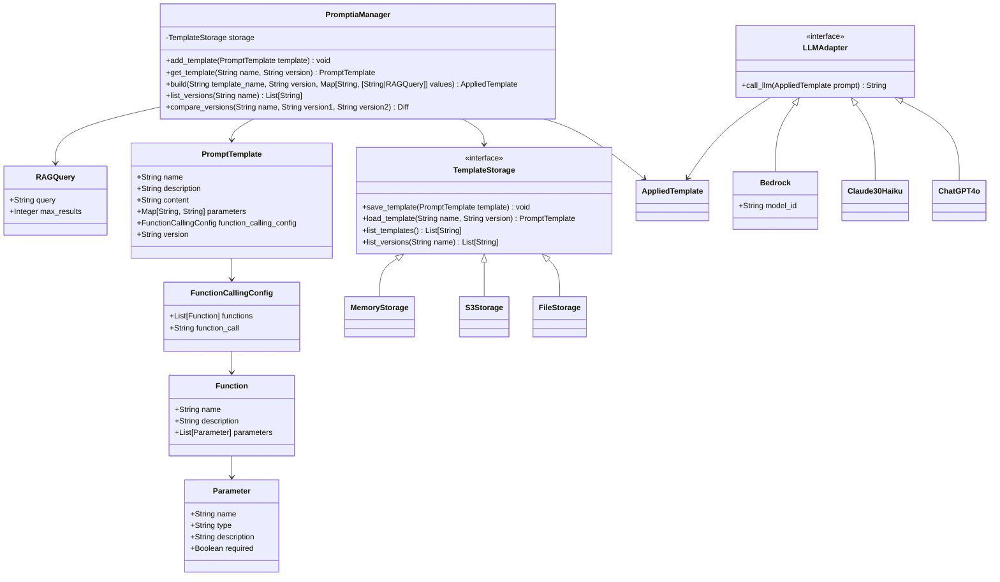

# Promptia ライブラリ仕様書

## 1. 概要

Promptiaは、LLM（大規模言語モデル）用のプロンプトを管理するPythonライブラリです。このライブラリは、異なるLLMやAPIに対応したプロンプトテンプレートを効率的に管理し、必要に応じて適切な形式に変換する機能を提供します。また、RAG（Retrieval-Augmented Generation）による情報の埋め込みをサポートし、より高度なプロンプト生成を可能にします。

## 2. 主要機能

1. LLM別、キーワード別のプロンプトテンプレート管理
2. 抽象的なテンプレートオブジェクトの管理と、特定のAPI形式への変換
3. Function Callingの詳細な設定と管理
4. テンプレートのバージョン管理
5. RAGによる動的な情報埋め込み（実行時のクエリ指定機能を含む）
6. モジュール化された設計（テンプレート構成、API変換、永続化、RAG）

## 3. アーキテクチャ

Promptiaは以下の主要モジュールで構成されています：

1. テンプレート構成モジュール
2. API変換モジュール
3. 永続化モジュール
4. バージョン管理モジュール
5. RAGモジュール

### 3.1 テンプレート構成モジュール

このモジュールは、プロンプトテンプレートを表現する抽象的なオブジェクトを定義し管理します。Function Callingの詳細設定も含みます。

### 3.2 API変換モジュール

抽象的なテンプレートオブジェクトを特定のLLM API（OpenAI、Claude、AWS Bedrock等）の形式に変換するロジックを提供します。

### 3.3 永続化モジュール

テンプレートオブジェクトをファイルシステムやクラウドストレージ（S3等）に保存・読み込みする機能を提供します。

### 3.4 バージョン管理モジュール

テンプレートの異なるバージョンを管理し、バージョン間の変更を追跡します。

### 3.5 RAGモジュール

関連する情報を検索し、プロンプトに動的に埋め込む機能を提供します。実行時のクエリ指定をサポートします。

## 4. クラス図

以下は、Promptiaのコアとなるクラス構造を示しています：



## 5. 主要クラスの説明

### 5.1 PromptTemplate

プロンプトテンプレートを表現する中心的なクラスです。テンプレート名、説明、内容、パラメータ、Function Calling設定、バージョンを保持します。

### 5.2 FunctionCallingConfig

Function Callingの詳細設定を管理するクラスです。Function Callingの関数定義、呼び出し方法を指定します。

### 5.3 TemplateStorage

テンプレートの永続化を担当するインターフェースです。FileStorageやS3Storageなどの具体的な実装クラスがこのインターフェースを実装します。

### 5.4 PromptiaManager

ライブラリの主要な機能を統括するクラスです。テンプレートの管理、レンダリング、バージョン管理、RAG処理などの操作を提供します。

### 5.3 RAGQuery

RAGのクエリーを管理するクラスです。パラメータの値としてクエリ、最大結果数として指定します。

### 5.4 LLMAdapter

異なるLLM APIに対応するためのインターフェースです。各LLMに対する実装クラスがこのインターフェースを実装します。

## 6. 使用例

以下は、RAG、パラメーター、およびFunction Callingを組み合わせた総合的な使用例です：

```python
from promptia import PromptiaManager, MemoryStorage, ChatGPT4o, PromptTemplate, RAGQuery, FunctionCallingConfig, Function, Parameter

# PromptiaManagerのインスタンス化
manager = PromptiaManager(MemoryStorage())

# Function Calling設定
function_config = FunctionCallingConfig(
    functions=[
        Function(
            name="get_weather",
            description="Get the current weather for a location",
            parameters=[
                Parameter(name="location", type="string", description="The city and country, e.g. Tokyo, Japan", required=True)
            ]
        )
    ],
    function_call="get_weather"
)

# テンプレートの作成
template = PromptTemplate(
    name="ai_news_and_weather",
    description="A template for summarizing latest AI news and getting weather information",
    content="""
    Here's a summary of the latest AI news:
    {latest_ai_news}

    Now, let's check the weather for {location}.
    
    Based on this information, provide a brief report on how the latest AI developments might be applied in {location}, considering the current weather conditions.
    """,
    parameters={
        "location": "string",
        "latest_ai_news": "query"
    },
    function_calling_config=function_config,
    version="1.0"
)

# テンプレートの追加
manager.add_template(template)

# テンプレートのレンダリングと動的RAGクエリの指定
prompt = manager.build(
    "ai_news_and_weather", 
    "1.0", 
    {
        "location": "San Francisco, USA",
        "latest_ai_news": RAGConfig(
            query="Latest news about AI and weather technology in San Francisco",
            max_results=5
        )
    }
)
result = ChatGPT4o.call_llm(prompt)

print("AI News and Weather Report:")
print(result)

# バージョン管理の例
versions = manager.list_versions("ai_news_and_weather")
print(f"\nAvailable versions: {versions}")

# バージョン間の比較
diff = manager.compare_versions("ai_news_and_weather", "1.0", "1.1")
print(f"\nDifferences between versions:")
print(diff)
```

## 7. 今後の拡張性

1. 新しいLLM APIへの対応（新しいLLMAdapterの実装）
2. 追加の永続化オプション（新しいTemplateStorageの実装）
3. テンプレートの自動テスト機能の実装
4. 異なる情報源やデータベースに対応するRAGプロセッサの拡張
5. RAGの結果をキャッシュする機能の追加
6. 複数のRAG結果を組み合わせる高度な情報統合機能の開発
```
